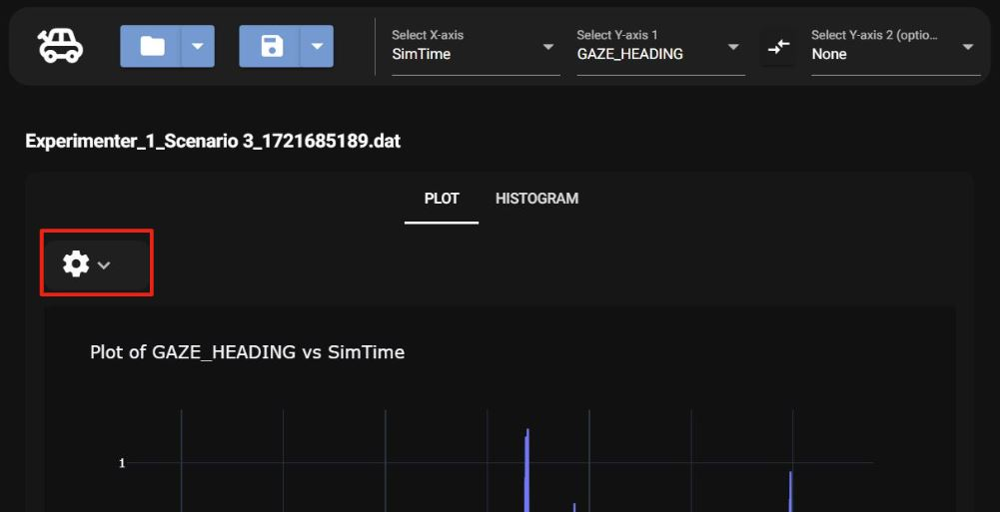

# Drag and Drop

Another way to load data files into the program is the drag and drop feature

To use the feature, select the settings icon,

Then drag and drop a dat file into the drop area and it will load the new graphs

*Note when using the drag and drop feature, the uploaded file will not be added to the recent files dropdown