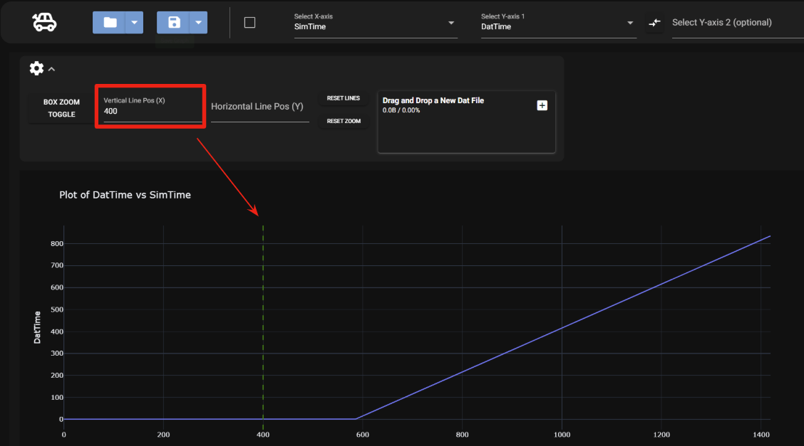
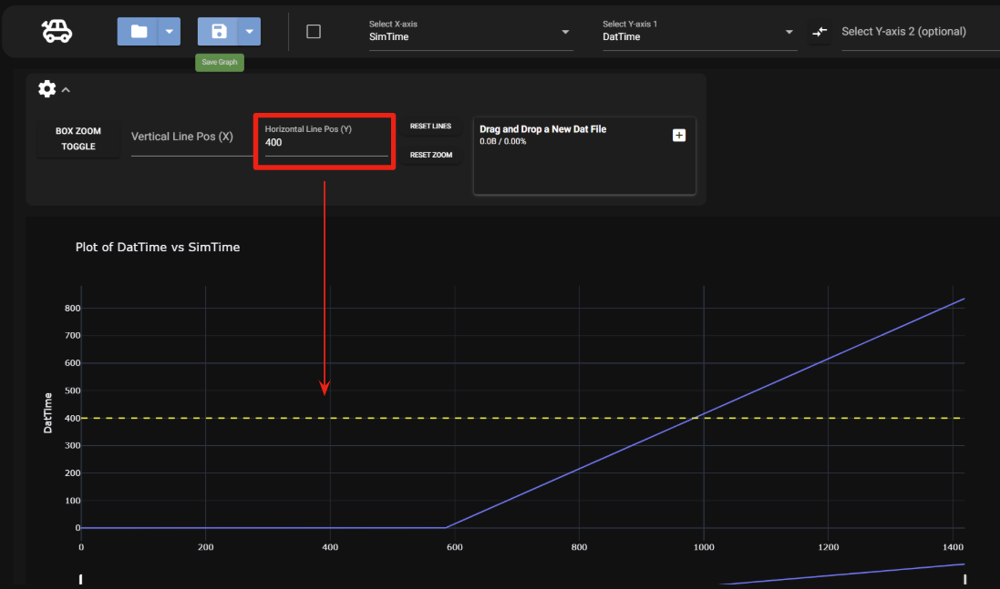
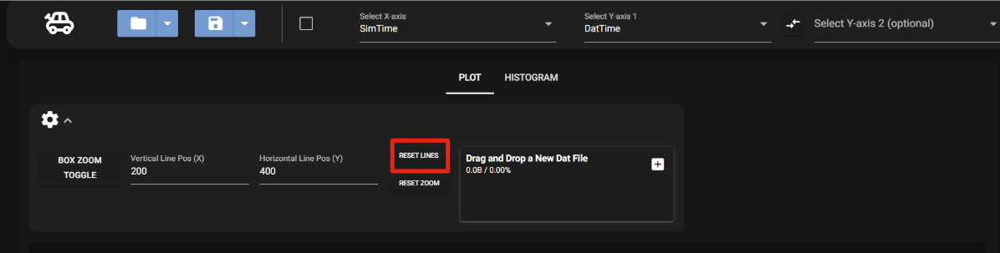

# Reference Lines

Vertical and horizontal reference lines can be added to the graph.

To add reference lines open the settings view.

## Vertical Line

To add a vertical line type in the vertical line position box the location of your desired line.

## Horizonal Line

To add a horizontal line type in the horizontal line position box the location of your desired line.

## Clearing Lines

To clear any lines on the graph select the reset lines button.

Once selected the lines will reset.
