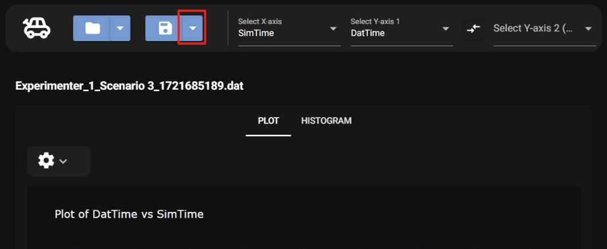
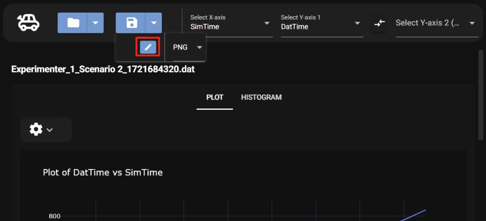
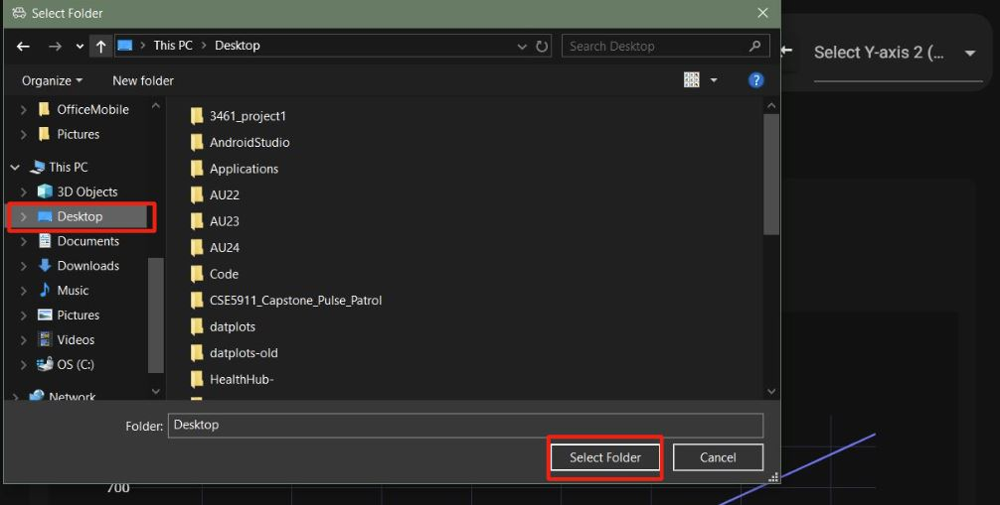
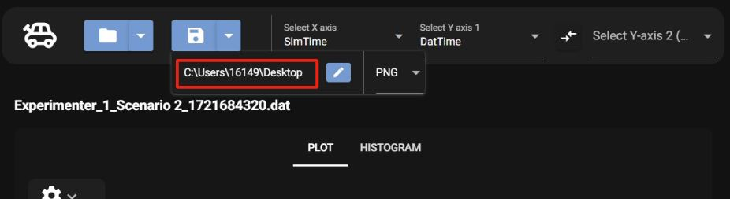
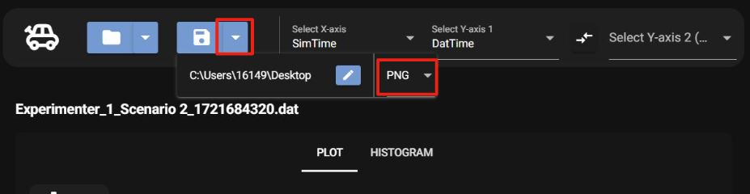

# Saving Opions

## Changing Save File Location

To pick a specific location to save the plot to on your computer,

### 1. Select save button dropdown

### 2. Select the edit button

### 3. Pick the desired file location

To view the current save location, under the save arrow the path can be seen.

## Changing Saved File Type

To change the save file type, select the save button dropdown. Then select the dropdown on the far right to pick between, PNG, JPEG, or SVG.

