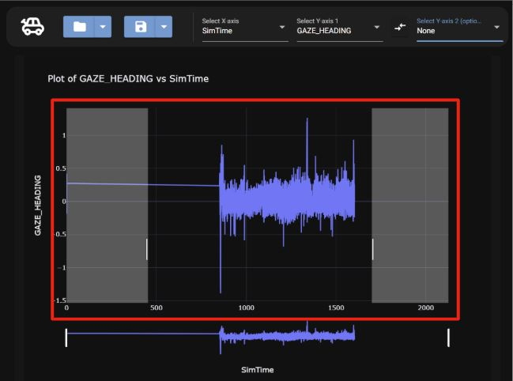
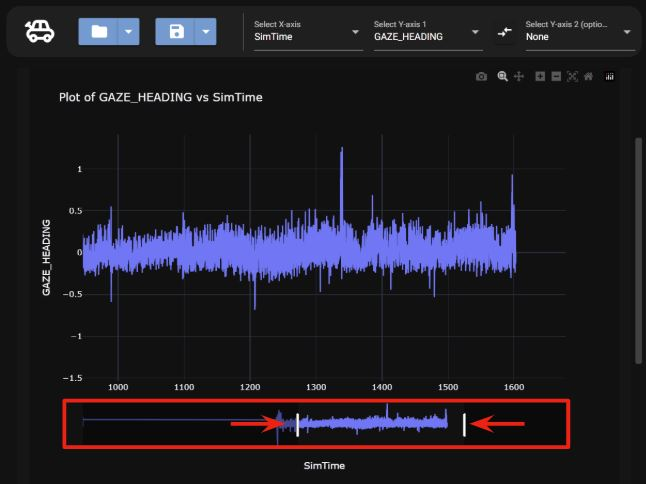

# Zooming

There are two different ways to zoom in the graph, using the slide zoom below the graph and the box zoom option in the options tab.

## Slide Zoom

To zoom in on the graph using the slide zoom, either highlight the graph or move the ends of the slider to specific points.

Highlighting

Sliding

## Box Zoom

To use the box zoom, the toggle needs to be selected following the steps below,

### 1. Select the setting button

### 2. Select the box zoom toggle button

The button will turn blue if the box zoom toggle is on.

To use the box zoom, highlight the area of the map that you want to zoom in on as seen below.

To stop using the box toggle go to settings and click the box zoom button so it turns gray.