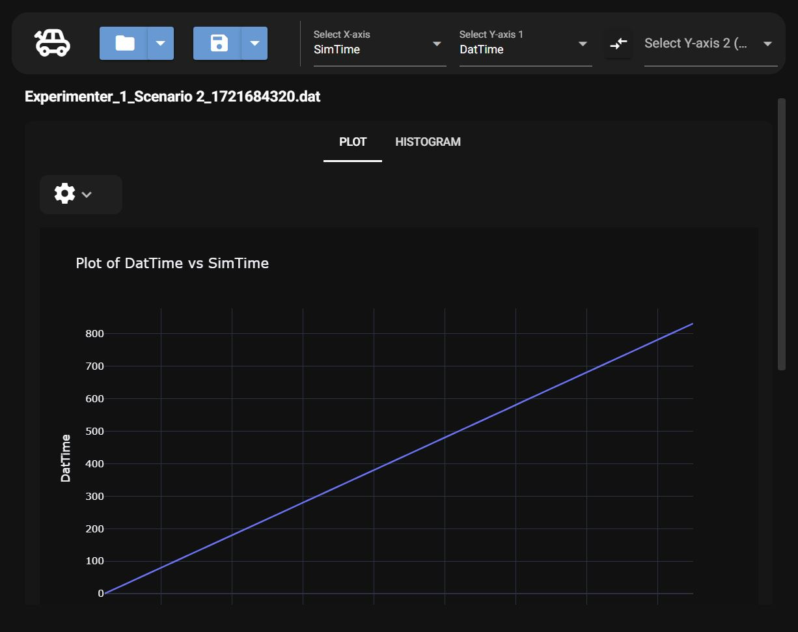

# Datplot Overview

DatPlot is a program that helps users view and analyze data. By uploading your data files, you can  generate interactive line graphs and histograms. The program also allows you to adjust axis points, making it easy to focus on different variables in the dataset

## About

DatPlot was created to help view driving simulation data at The Ohio State University Driving Simulation Laboratory. The program was created by research assistants to help aid data analysis efforts.  
