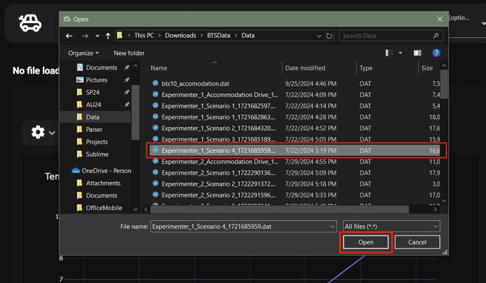
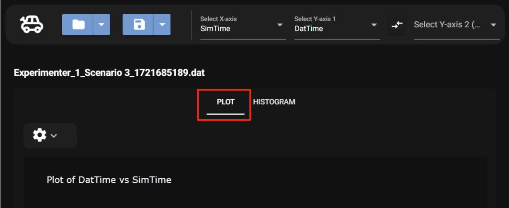
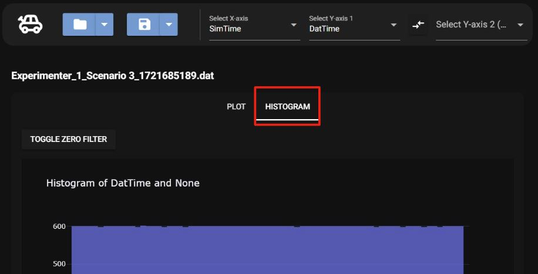

# Getting Started

## Opening a Dat File

Once the program is open and running, to open a dat file:

### 1.Select the file icon

### 2.Select the dat file in your file directory

Once opened the graph should update with the data

## Viewing a Dat File

Once a dat file is opened there are two ways to view the data, a line graph and a histogram

### Line Graph

The line chart will be selected first *change wording*

### Histogram

To view the data as histogram, select the histogram tab

## Saving a Graph

The dat file graph are able to be saved as images, for more details on changing the save file type and changing the saved file location, see [Saving Options](../features/saveLoc.md)

### Saving the Line Graph

To save the line graph make sure the chart tab is selected and select the save icon

### Saving the Histogram

To save the histogram graph make sure the histogram tab is selected and select the save icon

## Viewing Summary Stats

To see the summary statictics of the data, scroll under the graph to view

## Analyzing Data

Once a dat file is loaded, the data can be analyzed by changing the X and Y axes

### 1. Pick an X axis

Start by clicking on the X axis drop down and select a dataset

### 2. Pick a Y Axis

Once, an X axis is chosen the next step is to select a Y axis dataset from the Y axis dropdown

### 3. View Plot

Once the X and Y axes are chosen, the full plot can be viewed as seen below.

In the image, the X axis chosen was SimTime, and the Y axis chosen was Gaze Heading. This can also be seen in the title of the graph and along their respected axes.

### Second Y Axis

An option to add a second dataset along the Y axis is available. To add another Y dataset select the second Y axis option and pick a data set as seen in the image below.

Once the data set is chosen a second line a different color will be displayed. The new y Axis can be seen on the right of the graph.

