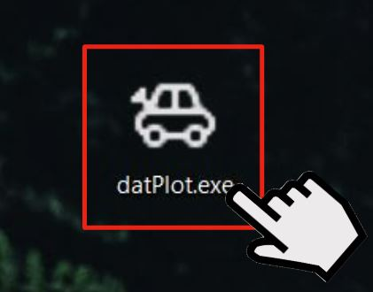

# Installation Instructions

## Downloading the Program

To get the program installed on a computer, download the [datplot executable](https://github.com/OSUDSL/datplots/releases/tag/Latest)

## Starting up the Program

The program might take a few minutes to complete downloading.

Once the datplot executable is downloaded, to start the program double click to open the executable.

This will open the program and it will be ready to use.

Note: The program may take a little longer to open on its first launch.
